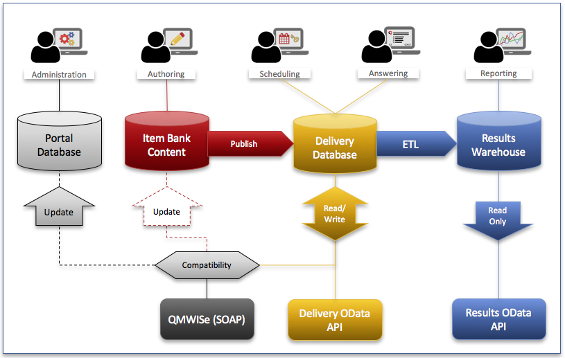

Overview
--------

Database Structure
~~~~~~~~~~~~~~~~~~

Questionmark data resides in a repository, in the context of
Questionmark OnDemand a repository is sometimes referred to informally
as an *area*. Repositories are identified by a simple repository name,
often referred to as a customerid in URLs.  In Questionmark OnDemand
repository names are allocated six-digit numbers although some older
repositories do have alphanumeric names.  Clients of the APIs should not
assume that repository IDs will always be numeric and should ensure
that IDs of up to 32 ASCII characters are supported.

The data in a repository is divided into three main databases covering
the three main functions of Questionmark's assessment management system:
content creation, delivery, and result reporting.  There is an
additional schema referred to as the "Portal Database" that contains
information about users and tables used to support the portal user
interface.

Historically (Perception 5.2 and earlier) all data was stored in a
single database which is now referred to as the delivery database.  The
older Enterprise Manager Reporter reports continue to use the delivery
database as their primary source of information.  Reports in Analytics
use the newer Results Warehouse (the reporting database) that was
introduced in Perception 5.4.

The diagram shows the three web-service APIs documented here and the
data sources they use.  Whereas Delivery OData and Results OData have
straightforward links to the Delivery Database and Results Warehouse
respectively, QMWISe uses a special compatibility layer to direct calls
to the appropriate data source.  Methods that affect users will result
in changes to both the Portal Database and the Delivery Database,
similarly methods that affect the assessment content may return or
update information in the authoring datbase (Item Bank Content).

..  note::
    Perception versions 5.4 and 5.7 continue to use the delivery
    database for storage of both authoring and delivery information.
    They do not contain the Portal Database or QMWISe compatibility
    layer.

These distinctions are important as the new OData APIs are designed to
access specific databases and which API you use will depend on which
data source is appropriate to your application.  For example, both
:od:svc:`Delivery OData<deliveryodata>` and :od:svc:`Results
OData<resultsodata>` provide access to information about assessment
results but the former reads information from the delivery database
whereas the latter reads information from the results warehouse.  The
APIs that affect the delivery database are optimised to minimise the
impact on any running assessments so provide limited filtering and
searching options but do provide real-time access to information.  In
contrast, the Results API provides more filtering options at the expense
of a small delay in availability due to the need to wait for the ETL
(Extract, Transform, Load) process to populate the results warehouse
from the live data.

At the time of writing, there are no publicly exposed APIs that access
the authoring database directly.

HTTPS API Endpoints
~~~~~~~~~~~~~~~~~~~

All API endpoints in Questionmark OnDemand use https.  Furthermore, due
to the constantly changing recommendations on protocols and ciphers that
are considered secure these services do change their capabilities from
time to time.

..  note::  We strongly suggest you upgrade your API clients to support
            TLS1.2 and the associated ECDHE ciphersuites. Support for
            TLS1.0 is expected to end 2018-06-30.  For
            example, see this `blog post from the PCI Security Standards
            Council
            <https://blog.pcisecuritystandards.org/migrating-from-ssl-and-early-tls>`_.
            The following are known minimum versions required to support TLS 1.2
            * OpenSSL 1.0.1
            * Java 8u32
            * `TLS 1.2 and .Net support <https://blogs.perficient.com/microsoft/2016/04/tsl-1-2-and-net-support/>`_.
                **.NET 4.6 and above** You don’t need to do any additional 
                work to support TLS 1.2, it’s supported by default.
                **.NET 4.5** TLS 1.2 is supported, but it’s not a default 
                protocol. You need to opt-in to use it. The following 
                code will make TLS 1.2 default, make sure to execute it 
                before making a connection to secured resource:
                    ServicePointManager.SecurityProtocol = SecurityProtocolType.Tls12
                **.NET 4.0** TLS 1.2 is not supported, but if you have 
                .NET 4.5 (or above) installed on the system then you still 
                can opt in for TLS 1.2 even if your application framework 
                doesn’t support it. The only problem is that 
                SecurityProtocolType in .NET 4.0 doesn’t have an entry for 
                TLS1.2, so we’d have to use a numerical representation of 
                this enum value:
                            ServicePointManager.SecurityProtocol = (SecurityProtocolType)3072;
                **.NET 3.5 or below** TLS 1.2 is not supported (*) and 
                there is no workaround. Upgrade your application to 
                more recent version of the framework.

Whereas the web browsers and operating systems in common use are all
updated frequently to include the latest https security protocols this
is not true for API clients which may have cryptographic libraries (like
openssl) statically linked or rely on an underlying interpreter or
language runtime (e.g., PHP, Java, etc) that is updated separately from
the host operating system.

Developers are advised to check carefully when creating API clients that
they are able to modify the client in whatever way is necessary to deal
with these changes and keep their client up to date.  To give a concrete
example, an API client developed in Java 6 requires update 111 (JDK
6u111, released early 2016) in order to use the TLS 1.1 protocol.
Earlier versions of Java are rapidly running out of options for creating
secure connections as this `report from SSL Labs
<https://www.ssllabs.com/ssltest/viewClient.html?name=Java&version=6u45&key=25>`_
clearly demonstrates.  Although it is impossible to predict when it will
happen it is highly likely that older Java 6 clients will stop working
with A+ rated sites like Questionmark OnDemand in the foreseeable
future. 

Furthermore, API clients may not be able to use the host operating
system's certificate store and require special configuration to validate
the OnDemand certificates. Even when the client does use the host
certificate store it is imperative that the host OS is kept updated with
the latest global trusted root certificates as these are also subject to
change.
 
..  warning::   Questionmark site certificates do change from time to
                time and may change at short notice. The changes may
                include requiring new root certificates even if using
                the  same root certificate authority. An example was the
                change from SHA1 to SHA2 signing. The root certificate
                authority used to sign the certificates is also subject
                to change.
